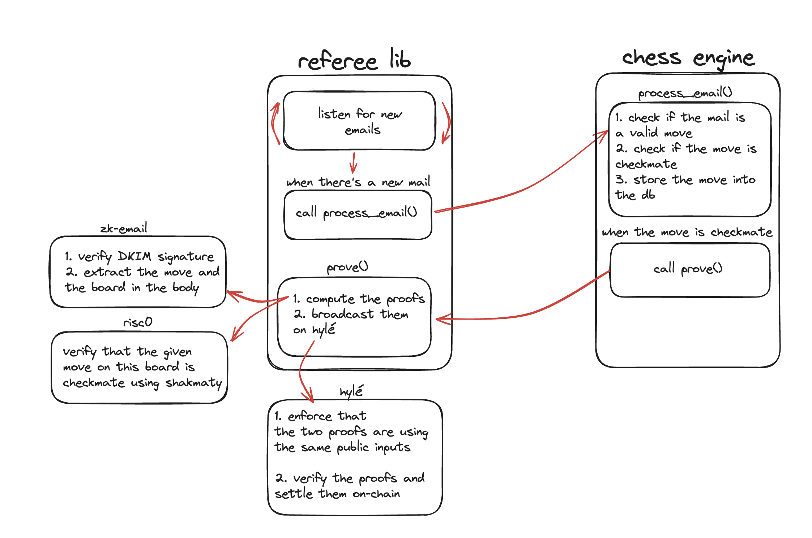

# Provable email game engine
This project consists of a library that enables to create provable [*play-by-email*](https://en.wikipedia.org/wiki/Play-by-mail_game) games, leveraging Zero-Knowledge proofs. 

We also provide an example project: a provable chess game played via emails.

**This project is work in progress and might not work as expected** (i still need to polish the code)

## Architecture

## Sponsor
*This project is supported by [Hylé](hyle.eu), the blockchain lean blockchain for your provable apps*

  

